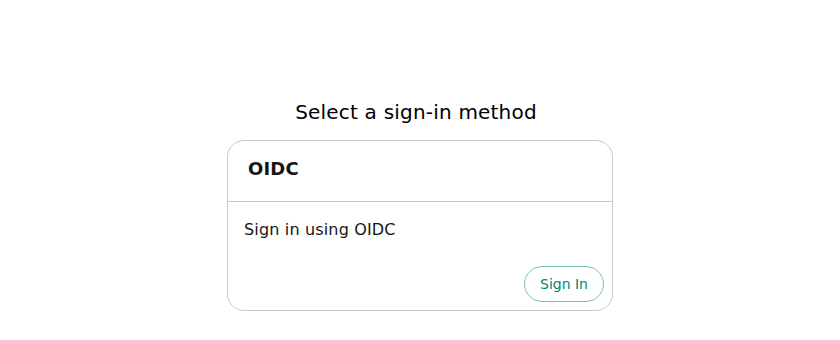

This page installs DevPortal 3.x on Kubernetes with the `devportal` Helm chart. The portal runs behind an Ingress with TLS, users sign in through an identity provider over OpenID Connect (OIDC), and guest sign-in is off. The steps use Keycloak as the identity provider and a PostgreSQL database that runs in the cluster, so you can follow them on an empty test cluster. [Replace the parts that are placeholders](#what-you-replace-for-your-environment) before you run the portal for real users.

:::warning Guest sign-in is on by default
The chart ships guest sign-in **enabled** and maps the guest identity to the `ADMIN` user (`user:default/admin`). Anyone who can reach the portal URL enters as an administrator, without a password. That is useful for a first look and dangerous for anything else. The single off switch is `global.veecode.guestAuth.enabled: false`, and [Step 6](#step-6-install-devportal) sets it. Never expose an installation with the default.
:::

## Before you start

You need:

- A Kubernetes cluster with an Ingress controller, and `kubectl` and Helm 3 pointed at it. The steps were followed on k3s 1.31 with its bundled Traefik controller (`className: traefik`) and Helm 3.20.
- Two DNS names that resolve to the Ingress controller: one for the portal and one for the identity provider. The steps use `devportal.example.com` and `keycloak.example.com`. The portal backend calls the identity provider's public name when a user signs out, so the cluster must resolve and reach that name too ([Step 6](#step-6-install-devportal) covers a cluster that cannot).
- `openssl` and `curl` on your machine, and a browser that allows pop-ups from the portal: the sign-in button opens the identity provider in a pop-up window.

The chart installs no database. The steps run a disposable PostgreSQL in the cluster. For production, use a PostgreSQL that you operate, and give the portal a user that can create databases, because the portal creates one database per plugin.

### What you replace for your environment

| Part | What the steps use | What you use |
| --- | --- | --- |
| Hostnames | `devportal.example.com` and `keycloak.example.com` | Your own names, set once in Step 1 |
| Certificate | A self-signed certificate that covers both names | A certificate from your certificate authority (CA), stored in the same kind of Secret in Step 2 |
| Trust for the certificate | The portal backend trusts the self-signed certificate, through `values-trust.yaml` in Step 6 | Nothing, when a public CA signed your certificate and the cluster resolves both names. For a private CA, the CA's own certificate in place of `tls.crt` |
| Identity provider | Keycloak in the cluster, in development mode | Your own Keycloak or another OIDC provider, which Step 4 lists the settings for |
| Database | PostgreSQL 16 in the cluster | Your PostgreSQL, in the Secret of Step 5 |
| Ingress class | `traefik` | The class of your controller, in the values file of Step 6 |

Run every command in one terminal session. Later steps use the shell variables that Step 1 sets.

## Step 1: Choose names and generate secrets

```bash
export NAMESPACE=devportal
export DEVPORTAL_HOST=devportal.example.com
export KEYCLOAK_HOST=keycloak.example.com

export DB_PASSWORD="$(openssl rand -hex 16)"
export BACKEND_SECRET="$(openssl rand -hex 16)"
export AUTH_SESSION_SECRET="$(openssl rand -hex 16)"
export KEYCLOAK_CLIENT_SECRET="$(openssl rand -hex 16)"
export KEYCLOAK_USER_PASSWORD="$(openssl rand -hex 16)"
```

Use the bare hostname, without `https://` and without a port. The chart builds `https://` followed by `global.host` for the application and backend URLs.

## Step 2: Create the namespace and the TLS Secret

```bash
kubectl create namespace "$NAMESPACE"

openssl req -x509 -newkey rsa:2048 -nodes -days 365 \
  -keyout tls.key -out tls.crt \
  -subj "/CN=$DEVPORTAL_HOST" \
  -addext "subjectAltName=DNS:$DEVPORTAL_HOST,DNS:$KEYCLOAK_HOST"

kubectl -n "$NAMESPACE" create secret tls devportal-tls --cert=tls.crt --key=tls.key
```

The certificate is self-signed, so browsers warn about it. With a certificate from your CA, create the same `devportal-tls` Secret from the certificate and key files you received. The certificate must cover both hostnames, or you must create a second Secret for the identity provider's Ingress. Keep `tls.key` private.

## Step 3: Start PostgreSQL

```bash
kubectl -n "$NAMESPACE" create secret generic devportal-db \
  --from-literal=POSTGRES_USER=devportal \
  --from-literal=POSTGRES_PASSWORD="$DB_PASSWORD" \
  --from-literal=POSTGRES_DB=devportal

kubectl -n "$NAMESPACE" apply -f - <<'EOF'
apiVersion: v1
kind: PersistentVolumeClaim
metadata:
  name: devportal-db
spec:
  accessModes: [ReadWriteOnce]
  resources:
    requests:
      storage: 2Gi
---
apiVersion: apps/v1
kind: Deployment
metadata:
  name: devportal-db
spec:
  replicas: 1
  strategy:
    type: Recreate
  selector:
    matchLabels: {app: devportal-db}
  template:
    metadata:
      labels: {app: devportal-db}
    spec:
      enableServiceLinks: false
      containers:
        - name: postgres
          image: postgres:16
          envFrom:
            - secretRef: {name: devportal-db}
          env:
            - {name: PGDATA, value: /var/lib/postgresql/data/pgdata}
          ports:
            - {containerPort: 5432}
          volumeMounts:
            - {name: data, mountPath: /var/lib/postgresql/data}
      volumes:
        - name: data
          persistentVolumeClaim: {claimName: devportal-db}
---
apiVersion: v1
kind: Service
metadata:
  name: devportal-db
spec:
  selector: {app: devportal-db}
  ports:
    - {port: 5432, targetPort: 5432}
EOF

kubectl -n "$NAMESPACE" rollout status deployment/devportal-db --timeout=10m
```

## Step 4: Start Keycloak

Skip this step if you already run an identity provider. The portal needs an OIDC client with these settings:

- A confidential client with the standard flow on, whose redirect URI is `https://devportal.example.com/api/auth/oidc/handler/frame` (your portal hostname).
- A service account that can read users and groups, with the `realm-management` roles `view-users`, `query-users`, `query-groups` and `view-realm`. The portal uses it to import your users and groups into its catalog.

The realm below creates that client and one user, `alice`. Keycloak reads the `${...}` values in the realm from the `keycloak-env` Secret.

```bash
kubectl -n "$NAMESPACE" create secret generic keycloak-env \
  --from-literal=DEVPORTAL_HOST="$DEVPORTAL_HOST" \
  --from-literal=KEYCLOAK_CLIENT_SECRET="$KEYCLOAK_CLIENT_SECRET" \
  --from-literal=KEYCLOAK_USER_PASSWORD="$KEYCLOAK_USER_PASSWORD"

cat > realm.json <<'EOF'
{
  "realm": "devportal",
  "enabled": true,
  "clients": [
    {
      "clientId": "devportal",
      "enabled": true,
      "protocol": "openid-connect",
      "publicClient": false,
      "secret": "${KEYCLOAK_CLIENT_SECRET}",
      "standardFlowEnabled": true,
      "directAccessGrantsEnabled": false,
      "serviceAccountsEnabled": true,
      "redirectUris": ["https://${DEVPORTAL_HOST}/*"],
      "webOrigins": ["https://${DEVPORTAL_HOST}"]
    }
  ],
  "users": [
    {
      "username": "alice",
      "email": "alice@example.com",
      "firstName": "Alice",
      "lastName": "Example",
      "enabled": true,
      "emailVerified": true,
      "credentials": [{"type": "password", "value": "${KEYCLOAK_USER_PASSWORD}", "temporary": false}]
    },
    {
      "username": "service-account-devportal",
      "enabled": true,
      "serviceAccountClientId": "devportal",
      "clientRoles": {"realm-management": ["view-users", "query-users", "query-groups", "view-realm"]}
    }
  ]
}
EOF

kubectl -n "$NAMESPACE" create configmap keycloak-realm --from-file=devportal-realm.json=realm.json

kubectl -n "$NAMESPACE" apply -f - <<EOF
apiVersion: apps/v1
kind: Deployment
metadata:
  name: keycloak
spec:
  replicas: 1
  selector:
    matchLabels: {app: keycloak}
  template:
    metadata:
      labels: {app: keycloak}
    spec:
      enableServiceLinks: false
      containers:
        - name: keycloak
          image: quay.io/keycloak/keycloak:26.3.3@sha256:6a7217a100bd3e5de4063a27a538ef999a3c5a88c4b4ec0ffc0a642aee7b2597
          args: ["start-dev", "--import-realm"]
          envFrom:
            - secretRef: {name: keycloak-env}
          env:
            - {name: KC_HOSTNAME, value: "https://$KEYCLOAK_HOST"}
            - {name: KC_HOSTNAME_BACKCHANNEL_DYNAMIC, value: "true"}
            - {name: KC_PROXY_HEADERS, value: xforwarded}
            - {name: KC_HTTP_ENABLED, value: "true"}
            - {name: KC_HEALTH_ENABLED, value: "true"}
          ports:
            - {name: http, containerPort: 8080}
            - {name: management, containerPort: 9000}
          readinessProbe:
            httpGet: {path: /health/ready, port: management}
            initialDelaySeconds: 15
            periodSeconds: 5
          volumeMounts:
            - {name: realm, mountPath: /opt/keycloak/data/import, readOnly: true}
      volumes:
        - name: realm
          configMap: {name: keycloak-realm}
---
apiVersion: v1
kind: Service
metadata:
  name: keycloak
spec:
  selector: {app: keycloak}
  ports:
    - {name: http, port: 8080, targetPort: http}
---
apiVersion: networking.k8s.io/v1
kind: Ingress
metadata:
  name: keycloak
spec:
  ingressClassName: traefik
  tls:
    - hosts: ["$KEYCLOAK_HOST"]
      secretName: devportal-tls
  rules:
    - host: "$KEYCLOAK_HOST"
      http:
        paths:
          - {path: /, pathType: Prefix, backend: {service: {name: keycloak, port: {number: 8080}}}}
EOF

kubectl -n "$NAMESPACE" rollout status deployment/keycloak --timeout=10m
```

Keycloak answers on two addresses. Browsers use the public name, `https://keycloak.example.com`, which is what `KC_HOSTNAME` sets. The portal backend uses the cluster Service, `http://keycloak:8080`, which Step 5 stores. With `KC_HOSTNAME_BACKCHANNEL_DYNAMIC` on, Keycloak gives the backend the Service address for the token, user information and signing key endpoints. It still lists the public address for the sign-out revocation endpoint, so when a user signs out the backend calls `https://keycloak.example.com`. Step 6 covers what the backend needs to reach that address.

## Step 5: Create the runtime Secret

The portal reads its database and identity provider settings from one Secret.

```bash
kubectl -n "$NAMESPACE" create secret generic veecode-runtime-secrets \
  --from-literal=PG_HOST=devportal-db \
  --from-literal=PG_PORT=5432 \
  --from-literal=PG_USER=devportal \
  --from-literal=PG_PASSWORD="$DB_PASSWORD" \
  --from-literal=PG_DATABASE=devportal \
  --from-literal=BACKEND_SECRET="$BACKEND_SECRET" \
  --from-literal=AUTH_SESSION_SECRET="$AUTH_SESSION_SECRET" \
  --from-literal=KEYCLOAK_BASE_URL=http://keycloak:8080 \
  --from-literal=KEYCLOAK_REALM=devportal \
  --from-literal=KEYCLOAK_CLIENT_ID=devportal \
  --from-literal=KEYCLOAK_CLIENT_SECRET="$KEYCLOAK_CLIENT_SECRET"
```

With your own PostgreSQL and identity provider, put their values here. `KEYCLOAK_BASE_URL` is the address the portal backend uses to reach the provider, and `KEYCLOAK_REALM` is the realm to read users from.

## Step 6: Install DevPortal

Add the chart repository and list the versions:

```bash
helm repo add veecode https://veecode-platform.github.io/next-charts
helm repo update
helm search repo veecode/devportal --versions
```

This page was followed with chart `0.1.26`, which installs image `3.0.0-beta.10`. The chart pins its image by digest, so the install pulls exactly the image the chart names. Install that version. If you pick a newer one from the list, read the note under `values-trust.yaml` below first.

Save this as `values.yaml`:

```bash
cat > values.yaml <<'EOF'
global:
  veecode:
    guestAuth:
      enabled: false
  dynamic:
    plugins:
      - package: ./dynamic-plugins/dist/backstage-community-plugin-catalog-backend-module-keycloak-dynamic
        disabled: false
        pluginConfig:
          catalog:
            providers:
              keycloakOrg:
                default:
                  baseUrl: ${KEYCLOAK_BASE_URL}
                  loginRealm: ${KEYCLOAK_REALM}
                  realm: ${KEYCLOAK_REALM}
                  clientId: ${KEYCLOAK_CLIENT_ID}
                  clientSecret: ${KEYCLOAK_CLIENT_SECRET}
                  schedule:
                    frequency: {minutes: 5}
                    initialDelay: {seconds: 15}
                    timeout: {minutes: 3}
upstream:
  ingress:
    enabled: true
    className: traefik
    tls:
      enabled: true
      secretName: devportal-tls
  backstage:
    extraEnvVarsSecrets:
      - veecode-runtime-secrets
    appConfig:
      signInPage: oidc
      auth:
        environment: production
        session:
          secret: ${AUTH_SESSION_SECRET}
        providers:
          oidc:
            production:
              metadataUrl: ${KEYCLOAK_BASE_URL}/realms/${KEYCLOAK_REALM}/.well-known/openid-configuration
              clientId: ${KEYCLOAK_CLIENT_ID}
              clientSecret: ${KEYCLOAK_CLIENT_SECRET}
              prompt: auto
EOF
```

What the values do:

`global.veecode.guestAuth.enabled: false`
: Removes the guest sign-in and the `ADMIN` mapping.

`upstream.ingress`
: Creates an Ingress for `global.host` that serves TLS from the `devportal-tls` Secret. Set `className` to the class of your controller.

`auth.environment: production`
: Selects the `production` entry of each provider under `auth.providers`, which is the `oidc.production` block of this file.

`signInPage: oidc`
: Makes the OIDC provider the sign-in method.

`prompt: auto`
: Lets the identity provider decide whether to ask for credentials or to skip the login prompt when the user has a session.

The `${...}` values are read from the runtime Secret when the portal starts. The catalog entry imports your Keycloak users and groups into the portal 15 seconds after it starts and then every 5 minutes, because the portal signs a user in only when it finds a matching user in its catalog.

### Let the backend reach and trust Keycloak

When a user signs out, the backend calls Keycloak at its public address (Step 4). The call fails unless the backend can resolve that name and trust its certificate. The portal then shows "Logout request failed" and keeps the user signed in. Skip the rest of this part, and drop `-f values-trust.yaml` from the install command, when a public CA signed your certificate and the cluster resolves both hostnames.

Otherwise, save this as `values-trust.yaml`. It does two things:

- `hostAliases` maps the Keycloak name to the cluster IP address of the ingress controller, for a cluster whose DNS does not know your names. The command reads that address from the `traefik` Service that k3s runs in `kube-system`. Use your controller's Service, or your DNS, instead.
- `NODE_EXTRA_CA_CERTS` makes the backend trust the certificate of Step 2. For a private CA, store the CA's own certificate in the ConfigMap instead of `tls.crt`.

```bash
kubectl -n "$NAMESPACE" create configmap devportal-ca --from-file=ca.crt=tls.crt

export INGRESS_IP="$(kubectl -n kube-system get service traefik -o jsonpath='{.spec.clusterIP}')"

cat > values-trust.yaml <<EOF
upstream:
  backstage:
    hostAliases:
      - ip: $INGRESS_IP
        hostnames: [$KEYCLOAK_HOST]
    extraEnvVars:
      - name: NODE_EXTRA_CA_CERTS
        value: /opt/app-root/src/devportal-ca.crt
    extraVolumeMounts:
      - {name: dynamic-plugins-root, mountPath: /opt/app-root/src/dynamic-plugins-root}
      - {name: extensions-catalog, mountPath: /extensions}
      - {name: temp, mountPath: /tmp}
      - {name: devportal-data, mountPath: /devportal-data}
      - {name: devportal-ca, mountPath: /opt/app-root/src/devportal-ca.crt, subPath: ca.crt, readOnly: true}
    extraVolumes:
      - name: dynamic-plugins-root
        ephemeral:
          volumeClaimTemplate:
            spec:
              accessModes: [ReadWriteOnce]
              resources:
                requests:
                  storage: 5Gi
      - name: dynamic-plugins
        configMap:
          defaultMode: 420
          name: '{{ printf "%s-dynamic-plugins" .Release.Name }}'
          optional: true
      - name: dynamic-plugins-npmrc
        secret:
          defaultMode: 420
          optional: true
          secretName: '{{ printf "%s-dynamic-plugins-npmrc" .Release.Name }}'
      - name: dynamic-plugins-registry-auth
        secret:
          defaultMode: 416
          optional: true
          secretName: '{{ printf "%s-dynamic-plugins-registry-auth" .Release.Name }}'
      - {name: npmcacache, emptyDir: {}}
      - {name: extensions-catalog, emptyDir: {}}
      - {name: temp, emptyDir: {}}
      - {name: devportal-data, emptyDir: {}}
      - {name: devportal-ca, configMap: {name: devportal-ca}}
EOF
```

Helm replaces a list instead of merging it, so the file repeats the chart's own `extraVolumeMounts` and `extraVolumes` entries and adds one entry to each (`devportal-ca`). The entries above are the ones of chart `0.1.26`. When you change the chart version, compare them with the output of `helm show values veecode/devportal --version VERSION` under `upstream.backstage`, and copy any entry that changed.

### Install the chart

The hostname is not in the files: `--set global.host` passes it.

```bash
helm install devportal veecode/devportal --version 0.1.26 \
  -n "$NAMESPACE" -f values.yaml -f values-trust.yaml \
  --set global.host="$DEVPORTAL_HOST" \
  --wait --timeout 20m
```

The install waits for the portal to be ready. The first start pulls the image (about 525 MB) and installs the plugins before the portal starts. It took 8 to 17 minutes on a shared test machine, so a slow link or a busy node needs the headroom of `--timeout 20m`.

## Step 7: Sign in and check

Check that the portal answers over HTTPS. `--cacert` trusts the certificate of Step 2:

```bash
kubectl -n "$NAMESPACE" get pods
curl -sS --cacert tls.crt -o /dev/null -w '%{http_code}\n' "https://$DEVPORTAL_HOST/"
```

Then open `https://devportal.example.com` in a browser (your portal hostname). Accept the certificate warning if you used the self-signed certificate.

1. The sign-in page offers the OIDC provider and no guest option.

   

2. Select **Sign In**. A pop-up window opens on Keycloak. Sign in as `alice` with the value of `$KEYCLOAK_USER_PASSWORD`.
3. The pop-up closes and the portal home page opens.
4. Open the menu with your name, at the top right, and select **Sign out**. You return to the sign-in page.

The portal signs a user in only after it has imported that user from Keycloak. The first import runs 15 seconds after the portal starts and the next ones every 5 minutes. For a user who is not in the portal's catalog yet, sign-in fails with "Failed to sign-in, unable to resolve user identity". Wait for the next import and sign in again.

### Install a plugin from the marketplace

The sidebar item **Marketplace** opens the **Extensions** page. Its **Catalog** tab lists the plugins you can install, and its **Installed packages** tab lists the packages the portal runs. This portal has no roles configured and every signed-in user can install plugins (see [What ships by default](#what-ships-by-default)).

1. In the **Catalog** tab, search for `Datadog` and select **Install** on its card. Confirm with **Install**: the dialog says the change takes effect after a restart. The card now shows **Pending install**.
2. Restart the portal with the commands below. The restart installs the plugin before the portal starts, so it takes about as long as the first start.
3. Sign in again. **Installed packages** has one more entry, and the Datadog card offers **Disable**.

```bash
kubectl -n "$NAMESPACE" rollout restart deployment/devportal-developer-hub
kubectl -n "$NAMESPACE" rollout status deployment/devportal-developer-hub
```

Kubernetes stops waiting when a rollout shows no progress for 10 minutes, and `rollout status` then ends with "exceeded its progress deadline". On a slow node the restart is still running at that point. Run `kubectl -n "$NAMESPACE" get pods --watch` and continue when the new pod shows `1/1 Running`.

The portal stores the installation in its PostgreSQL database, in the `marketplace_installations` table of the `backstage_plugin_extensions` database, which is why it survives the restart.

## Evaluate without Ingress or an identity provider

For a quick look on a laptop you can skip Ingress, TLS and the identity provider and keep guest sign-in. This is for evaluation only: guest sign-in signs everyone in as `ADMIN` (`user:default/admin`). Use a cluster that does not hold the installation above. The chart creates a ClusterRole named after the release, so a second release called `devportal` in another namespace fails.

Set the variables and create the namespace:

```bash
export NAMESPACE=devportal
export DB_PASSWORD="$(openssl rand -hex 16)"
export BACKEND_SECRET="$(openssl rand -hex 16)"

kubectl create namespace "$NAMESPACE"
```

Start PostgreSQL with the commands of [Step 3](#step-3-start-postgresql). Then create the runtime Secret. It needs only the database settings and the backend secret:

```bash
kubectl -n "$NAMESPACE" create secret generic veecode-runtime-secrets \
  --from-literal=PG_HOST=devportal-db \
  --from-literal=PG_PORT=5432 \
  --from-literal=PG_USER=devportal \
  --from-literal=PG_PASSWORD="$DB_PASSWORD" \
  --from-literal=PG_DATABASE=devportal \
  --from-literal=BACKEND_SECRET="$BACKEND_SECRET"
```

Save the values as `values-eval.yaml` and install the chart without `global.host`:

```bash
cat > values-eval.yaml <<'EOF'
upstream:
  backstage:
    extraEnvVarsSecrets:
      - veecode-runtime-secrets
    appConfig:
      app:
        baseUrl: http://localhost:7007
      backend:
        baseUrl: http://localhost:7007
        cors:
          origin: http://localhost:7007
EOF

helm repo add veecode https://veecode-platform.github.io/next-charts
helm repo update

helm install devportal veecode/devportal --version 0.1.26 \
  -n "$NAMESPACE" -f values-eval.yaml \
  --wait --timeout 20m
```

The URLs say `http` explicitly because the chart builds `https://` URLs from `global.host` when you set it. Forward the service and open `http://localhost:7007`:

```bash
kubectl -n "$NAMESPACE" port-forward svc/devportal-developer-hub 7007:7007
```

The sign-in page offers **Guest** and a GitHub sign-in that needs an OAuth app this page does not set up. Choose **Guest** and select **Enter**: you land on the home page as `Admin`.

## Disable a default plugin

The default plugins are baked into the DevPortal image, not declared in the chart's `values.yaml`, and `global.dynamic.plugins` only adds to them. To disable a default plugin, add an entry with its exact package reference and `disabled: true`. The chart's [product face guide](https://github.com/veecode-platform/devportal-chart/blob/main/docs/product-face-overrides.md) lists every reference. This example disables Tech Radar:

```yaml
global:
  dynamic:
    plugins:
      - package: ./dynamic-plugins/dist/backstage-community-plugin-tech-radar
        disabled: true
      - package: ./dynamic-plugins/dist/backstage-community-plugin-tech-radar-backend-dynamic
        disabled: true
```

Add the entries to the `plugins` list of your `values.yaml` and run `helm upgrade` with the same `-f` files.

## What ships by default

The image runs these plugins without an entry in your values. The **Installed packages** tab lists them, together with the Keycloak module that `values.yaml` adds:

- The VeeCode home page, the global header and an About page.
- The Marketplace, which is the **Extensions** page.
- TechDocs, Notifications, Signals and Tech Radar.
- The RBAC screens, without the RBAC backend. Permission checks are off: the portal reads `permission.enabled` from the `PERMISSION_ENABLED` variable and the chart does not set it. Every signed-in user can install plugins from the Marketplace.

The chart also creates a read-only ClusterRole and binding for the Kubernetes plugin (`kubernetesPlugin.rbac.enabled`, on by default). The image does not load the Kubernetes plugin by default.

## Version and lineage

Each chart version pins its image by digest. Chart `0.1.26` installs image `3.0.0-beta.10`. Never point production at `:edge`.

The chart source is [veecode-platform/devportal-chart](https://github.com/veecode-platform/devportal-chart). It is a renamed fork of [redhat-developer/rhdh-chart](https://github.com/redhat-developer/rhdh-chart) pinned at `backstage-7.0.1`.

## Attribution

The OIDC configuration and the identity provider steps on this page are adapted from [Red Hat Developer Hub documentation](https://github.com/redhat-developer/red-hat-developers-documentation-rhdh), licensed under the [Apache License 2.0](https://www.apache.org/licenses/LICENSE-2.0). VeeCode modified the text: it replaced Red Hat build of Keycloak with Keycloak, changed the configuration to the `devportal` chart, and added the steps for the Ingress, the certificate and the database.
