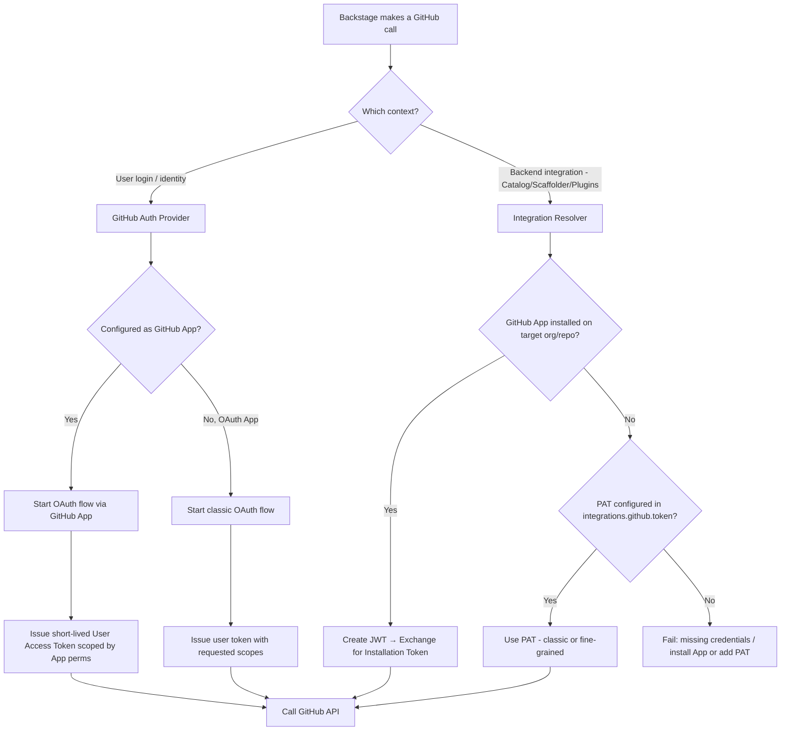

Some confusion comes up a lot when wiring up Backstage with GitHub. There are indeed many overlapping options and some choices also work as a fallback for others. This document breaks them down clearly and briefly before delving into the details of each option.

## Authentication (GitHub App / OAuth App)

These options (**GitHub App** or **OAuth App**) are used as a primary authentication path: users will login into Backstage using their GitHub account, either through a GitHub App or OAuth App (both are OAuth 2.0).

import styles from '../../style.module.css';

<figure className={styles['image-container']}>
  
  <figcaption className={styles['caption']}>
    GitHub Login screen
  </figcaption>
</figure>

## GitHub Personal Access Tokens (PATs)

The **GitHub Personal Access Tokens (PATs)** are used by Backstage to access GitHub resources on your behalf:

- Scaffolder actions (repo creation from templates).
- Catalog ingestion (as a fallback when no GitHub App is configured).

PATs can be of two types:

- Classic PATs: broad scopes (repo, admin:org) and long-lived.
- Fine-grained PATs: limited to specific repos/orgs, shorter-lived.

:::note
Local and development setups usually rely solely on PATs and "guest mode" (no authentication).
:::

## Where confusion happens

Backstage auth provider (login) and integrations (catalog, scaffolder, plugins) are configured separately but may share some settings.

Even if you set up a GitHub App for user login, a plugin may still expect a token in app-config.yaml.

If no GitHub App token is available in a given context, Backstage often falls back to a PAT if one is configured in `integrations.github[].token`.

This can lead to inconsistent behavior:

- Some calls use GitHub App credentials/tokens.
- Some calls silently fall back to PAT.

Developers sometimes think “auth is broken” when in fact a PAT is missing or expired.

## Rule of thumb

For production: prefer GitHub App (for both login + backend). Keep a PAT only as a last-resort fallback (e.g., for repos the App isn’t installed in, for legacy plugins or for scaffolder actions).

Be explicit in config: avoid mixing unless necessary, so you know which token type is in play.

## Decision tree

This is a decision tree to help you understand which token type is used in which context:

### How to read this:

- User login path: always OAuth. If you chose GitHub App, users get short-lived, app-scoped user tokens. If you chose a classic OAuth App, they get an OAuth token with the requested scopes.

- Backend path (catalog, scaffolder, techdocs, etc.): prefers GitHub App installation tokens. If the App isn’t installed for that repo/org, Backstage will fall back to a PAT if you configured one. Otherwise the call fails.