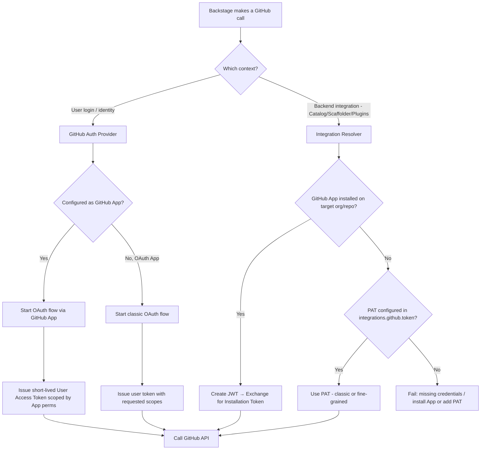

GitHub is one of the most common integrations in VeeCode DevPortal (Backstage). Understanding how authentication and backend integrations work with GitHub is essential for a smooth setup.

## Overview

VeeCode DevPortal interacts with GitHub in two distinct ways:

- **[Authentication](./github-auth.md)**: How users sign in to DevPortal using their GitHub accounts (via GitHub App or OAuth App).
- **[Backend Integrations](./github-integrations.md)**: How DevPortal's backend services (catalog, scaffolder, plugins) access GitHub APIs to fetch data and perform actions.

These two aspects are configured separately but can sometimes share credentials or fall back to each other, which is a common source of confusion.

## Why it matters

When configuring GitHub with DevPortal, you'll encounter multiple credential types:

- **GitHub App** or **OAuth App** credentials for user authentication
- **GitHub App** credentials for backend operations
- **Personal Access Tokens (PATs)** as a fallback for backend operations

Understanding when each is used prevents common issues like "auth is broken" when actually something like a PAT is missing or expired.

## Rule of thumb

A few general tips:

- **For development**: use guest auth (no real auth) and PAT for backend operations.

- **For simple use cases (or PoCs)**: use a single GitHub App (for both login + backend). It's simpler and less prone to errors, but please understand the impact. Keep a PAT only as a last-resort fallback (e.g., for repos the App isn’t installed in, for legacy plugins or for scaffolder actions).

- **For production setup**: use OAuth App (for login) + GitHub App (for backend). Keep a PAT only as a last-resort fallback too.

This is a rich subject to understand, but it's not rocket science. Some production environments may require a more complex setup (e.g., using separate credentials for each organization), but for most cases the above tips should be enough.

## Decision tree

This is a decision tree to help you understand which token type is used in which context:

### How to read this

- User login path: always OAuth. If you chose GitHub App, users get short-lived, app-scoped user tokens. If you chose a classic OAuth App, they get an OAuth token with the requested scopes.

- Backend path (catalog, scaffolder, techdocs, etc.): prefers GitHub App installation tokens. If the App isn’t installed for that repo/org, Backstage will fall back to a PAT if you configured one. Otherwise the call fails.
