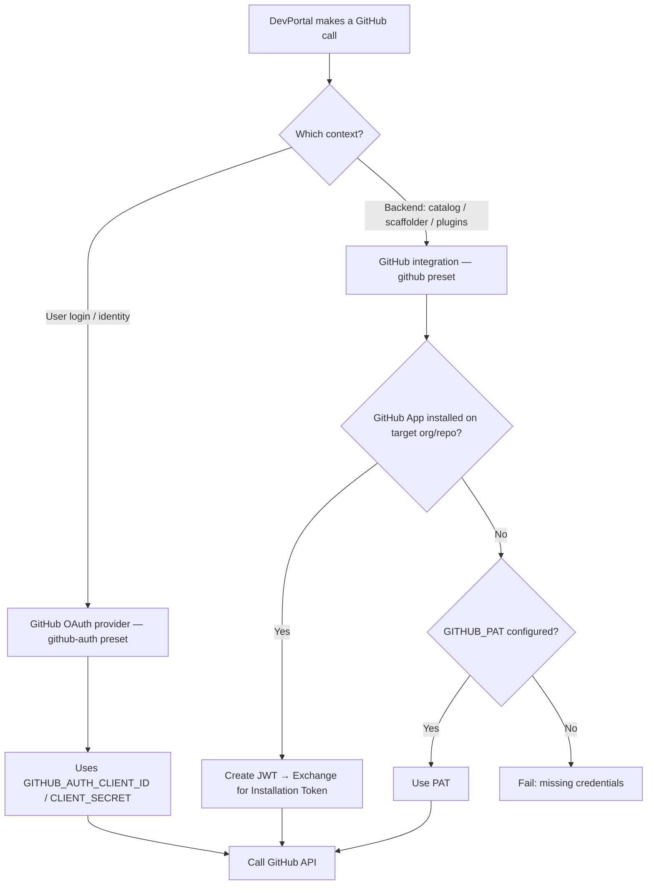

GitHub is one of the most common integrations in VeeCode DevPortal (Backstage). V2 activates GitHub capabilities through two composable presets: `github` for SCM/backend operations and `github-auth` for OAuth sign-in and org sync.

## Overview

VeeCode DevPortal interacts with GitHub in two distinct ways:

- **[Authentication / identity](./github-auth.md)**: How users sign in to DevPortal using their GitHub accounts (via OAuth App). Activated by the `github-auth` preset.
- **[Backend integrations](./github-integrations.md)**: How DevPortal's backend services (catalog, scaffolder, plugins) access GitHub APIs to fetch data and perform actions. Activated by the `github` preset.

These two aspects are configured as separate presets and can be combined freely. For a full GitHub stack, use both:

```sh
VEECODE_PRESETS=recommended,github,github-auth
```

For GitHub as SCM with a different identity provider (e.g., Keycloak), omit `github-auth` and add your identity preset instead.

## Why separate presets?

Separating SCM from identity lets you:

- Use GitHub repositories but sign in via Keycloak, LDAP, or Azure AD.
- Use GitHub OAuth as your identity provider while storing code in GitLab or Azure DevOps.
- Grant the SCM PAT only `repo`/`read:org` scopes without conflating them with OAuth consent scopes shown to users.

## `github` preset — SCM and backend

The `github` preset wires:

- The GitHub integration token for catalog/scaffolder/backend plugin calls (`GITHUB_PAT`)
- The GitHub catalog provider for automated `catalog-info.yaml` discovery from your org's repos (`GITHUB_ORG`)
- The GitHub Actions UI tab on entity pages

Required environment variables:

| Variable | Description |
|---|---|
| `GITHUB_PAT` | Personal Access Token with `repo` and `read:org` scopes |
| `GITHUB_ORG` | GitHub organization to scan for `catalog-info.yaml` files |

## `github-auth` preset — OAuth sign-in and org sync

The `github-auth` preset wires:

- GitHub OAuth sign-in for users
- The `githubOrg` catalog provider, which syncs org members and teams as `User`/`Group` entities
- Disables the guest fallback so the login screen presents GitHub OAuth

Required environment variables:

| Variable | Description |
|---|---|
| `GITHUB_PAT` | Personal Access Token with `read:org` scope (used by the githubOrg catalog provider) |
| `GITHUB_ORG` | GitHub organization whose members/teams sync into the catalog |
| `GITHUB_AUTH_CLIENT_ID` | OAuth App client ID from GitHub Developer Settings |
| `GITHUB_AUTH_CLIENT_SECRET` | OAuth App client secret |

:::note
`github-auth` belongs to the exclusive `identity` group. Only one identity preset can be active per deployment.
:::

## Decision tree

This is a decision tree to help you understand which credential is used in which context:


```mermaid
flowchart TD
    A[DevPortal makes a GitHub call] --> B{Which context?}

    B -->|User login / identity| U1[GitHub OAuth provider — github-auth preset]
    U1 --> U2[Uses GITHUB_AUTH_CLIENT_ID / CLIENT_SECRET]
    U2 --> Z[Call GitHub API]

    B -->|Backend: catalog / scaffolder / plugins| I1[GitHub integration — github preset]
    I1 --> I2{GitHub App installed on target org/repo?}
    I2 -->|Yes| I3[Create JWT → Exchange for Installation Token]
    I3 --> Z
    I2 -->|No| I4{GITHUB_PAT configured?}
    I4 -->|Yes| I5[Use PAT]
    I4 -->|No| I6[Fail: missing credentials]
    I5 --> Z
```

### How to read this

- **User login path** (`github-auth` preset): always OAuth via a GitHub OAuth App. Users get an OAuth token with the requested scopes.
- **Backend path** (`github` preset): uses the `GITHUB_PAT` for catalog discovery, scaffolder actions, and plugin API calls. If a GitHub App is configured in an `app-config.local.yaml` overlay, Backstage prefers App installation tokens and falls back to the PAT.

## Composition examples

### Full GitHub stack

```sh
VEECODE_PRESETS=recommended,github,github-auth
GITHUB_PAT=ghp_xxxx
GITHUB_ORG=my-org
GITHUB_AUTH_CLIENT_ID=Iv1.abcdef0123456789
GITHUB_AUTH_CLIENT_SECRET=github-oauth-secret
```

### GitHub as SCM + Keycloak as identity

```sh
VEECODE_PRESETS=recommended,github,keycloak
GITHUB_PAT=ghp_xxxx
GITHUB_ORG=my-org
KEYCLOAK_BASE_URL=https://keycloak.example.com/auth
KEYCLOAK_REALM=my-realm
KEYCLOAK_CLIENT_ID=devportal
KEYCLOAK_CLIENT_SECRET=xxx
AUTH_SESSION_SECRET=xxx
```

### GitHub as identity only (no GitHub repos)

```sh
VEECODE_PRESETS=recommended,github-auth
GITHUB_PAT=ghp_xxxx
GITHUB_ORG=my-org
GITHUB_AUTH_CLIENT_ID=Iv1.abcdef0123456789
GITHUB_AUTH_CLIENT_SECRET=github-oauth-secret
```
