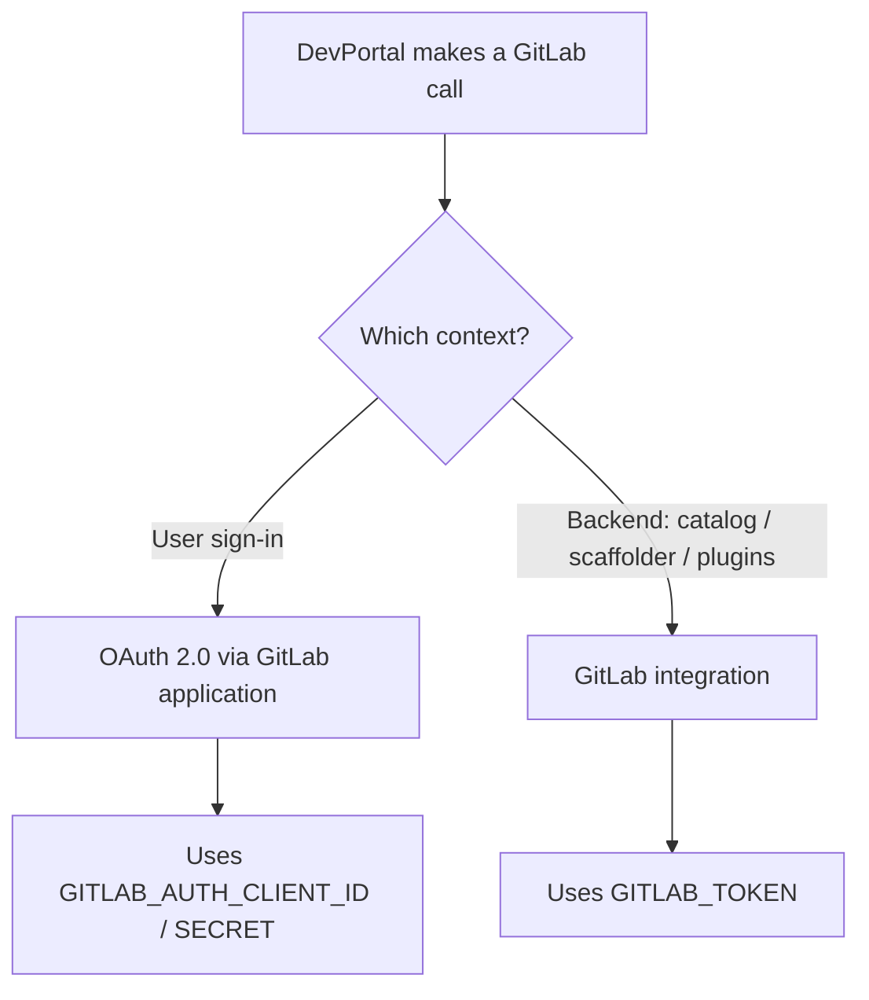

GitLab is a supported identity and SCM provider in VeeCode DevPortal. In V2, both GitLab OAuth authentication and the GitLab catalog/scaffolder integration are activated by the single `gitlab` preset — there is no separate `gitlab-auth` preset.

## Overview

The `gitlab` preset covers all GitLab-related functionality in one activation:

- **Authentication**: Users sign in with their GitLab accounts via OAuth 2.0.
- **SCM integration**: The DevPortal backend (catalog, scaffolder) accesses GitLab APIs using a Personal or Group Access Token.
- **Org sync**: GitLab groups and their members are ingested as Backstage `Group` and `User` catalog entities.

:::important
The `gitlab` preset belongs to the exclusive `identity` group. Only one identity preset can be active per deployment. You cannot combine `gitlab` with `github-auth`, `azure-auth`, `keycloak`, or `ldap`.
:::

## Activating the preset

```sh
VEECODE_PRESETS=recommended,gitlab
```

## Required environment variables

| Variable | Description |
|---|---|
| `GITLAB_HOST` | GitLab hostname (e.g., `gitlab.com` or `gitlab.example.com`) |
| `GITLAB_AUTH_CLIENT_ID` | OAuth Application ID (for sign-in) |
| `GITLAB_AUTH_CLIENT_SECRET` | OAuth Application Secret |
| `GITLAB_TOKEN` | Personal or Group Access Token with `read_api` scope (for integrations and org sync) |
| `GITLAB_GROUP` | Root group for org sync and repo discovery (e.g., `my-org`) |

## Optional environment variables

| Variable | Default | Description |
|---|---|---|
| `GITLAB_GROUP_PATTERN` | `[\s\S]*` | Regex pattern to match sub-groups for catalog sync |

## Step 1: Create a GitLab OAuth application

1. Go to your group or user **Settings → Applications** (for a self-hosted instance, you can also use the admin area).
2. Fill in:
   - **Name**: VeeCode DevPortal
   - **Redirect URI**: `https://<your-instance>/api/auth/gitlab/handler/frame`
   - **Scopes**: `read_user`, `openid`, `profile`, `email`
3. Save the application and note the **Application ID** and **Secret**.

## Step 2: Create a Group or Personal Access Token

The backend integration requires a token with `read_api` scope so the catalog and scaffolder can read repository data.

1. Go to **User Settings → Access Tokens** (or a group's **Settings → Access Tokens** for a group token).
2. Select scopes: `read_api` (and `write_repository` if the scaffolder needs to create branches or PRs).
3. Save the token — you will not see it again.

## Decision tree



## What the preset configures

The `gitlab` preset (`presets/gitlab.yaml`) produces the following `app-config` at boot:

```yaml
signInPage: gitlab

platform:
  guest:
    enabled: false
  signInProviders:
    - gitlab

auth:
  environment: production
  providers:
    gitlab:
      production:
        clientId: ${GITLAB_AUTH_CLIENT_ID}
        clientSecret: ${GITLAB_AUTH_CLIENT_SECRET}
        # For self-hosted GitLab uncomment:
        # audience: https://${GITLAB_HOST}
        signIn:
          resolvers:
            - resolver: usernameMatchingUserEntityName
            - resolver: emailMatchingUserEntityProfileEmail
            - resolver: emailLocalPartMatchingUserEntityName

integrations:
  gitlab:
    - host: ${GITLAB_HOST}
      token: ${GITLAB_TOKEN}

catalog:
  providers:
    gitlab:
      default:
        host: ${GITLAB_HOST}
        group: ${GITLAB_GROUP}
        orgEnabled: true
        restrictUsersToGroup: true
        includeUsersWithoutSeat: true
        relations:
          - INHERITED
          - DESCENDANTS
          - SHARED_FROM_GROUPS
        groupPattern: ${GITLAB_GROUP_PATTERN}
        branch: main
        fallbackBranch: master
        skipForkedRepos: false
        entityFilename: catalog-info.yaml
        rules:
          - allow: [Group, User]
        schedule:
          frequency: { minutes: 5 }
          timeout: { minutes: 3 }
```

## Quick start

### Minimal `docker run`

```bash
docker run -p 7007:7007 \
  -e VEECODE_PRESETS=recommended,gitlab \
  -e GITLAB_HOST=gitlab.com \
  -e GITLAB_AUTH_CLIENT_ID=<your-client-id> \
  -e GITLAB_AUTH_CLIENT_SECRET=<your-client-secret> \
  -e GITLAB_TOKEN=<your-access-token> \
  -e GITLAB_GROUP=<your-root-group> \
  veecode/devportal:2.2.0
```

### Docker Compose

```yaml
services:
  devportal:
    image: veecode/devportal:2.2.0
    ports:
      - "7007:7007"
    environment:
      VEECODE_PRESETS: recommended,gitlab
      GITLAB_HOST: gitlab.com
      GITLAB_AUTH_CLIENT_ID: ${GITLAB_AUTH_CLIENT_ID}
      GITLAB_AUTH_CLIENT_SECRET: ${GITLAB_AUTH_CLIENT_SECRET}
      GITLAB_TOKEN: ${GITLAB_TOKEN}
      GITLAB_GROUP: ${GITLAB_GROUP}
      GITLAB_GROUP_PATTERN: "[\\.\\s\\S]*"
```

## Sign-in resolvers

The three resolvers are tried in order; the first match establishes the Backstage identity:

| Resolver | What it matches |
|---|---|
| `usernameMatchingUserEntityName` | GitLab username → `metadata.name` on the User entity |
| `emailMatchingUserEntityProfileEmail` | GitLab primary email → `spec.profile.email` |
| `emailLocalPartMatchingUserEntityName` | Email local part → `metadata.name` |

## Troubleshooting

- **Callback URL mismatch**: The redirect URI in your GitLab application must match `https://<your-instance>/api/auth/gitlab/handler/frame` exactly.
- **Sign-in resolvers failing**: Ensure users in the catalog have `spec.profile.email` or `metadata.name` matching their GitLab username. The three resolvers are tried in order; the first match wins.
- **Catalog not ingesting repos**: Verify the `GITLAB_TOKEN` has `read_api` scope and is scoped to the correct group.
- **Self-hosted instance**: Uncomment and set `audience: https://${GITLAB_HOST}` in the auth provider config (via `app-config.local.yaml` override). Without it, token validation may fail.
- **Exclusive-group conflict at boot**: You have more than one identity preset in `VEECODE_PRESETS`. Keep only `gitlab` or switch to a different identity preset.

## References

- [Backstage GitLab Auth Provider](https://backstage.io/docs/auth/gitlab/provider/)
- [Backstage GitLab Integration](https://backstage.io/docs/integrations/gitlab/locations/)
- [GitLab OAuth Applications](https://docs.gitlab.com/ee/integration/oauth_provider.html)
