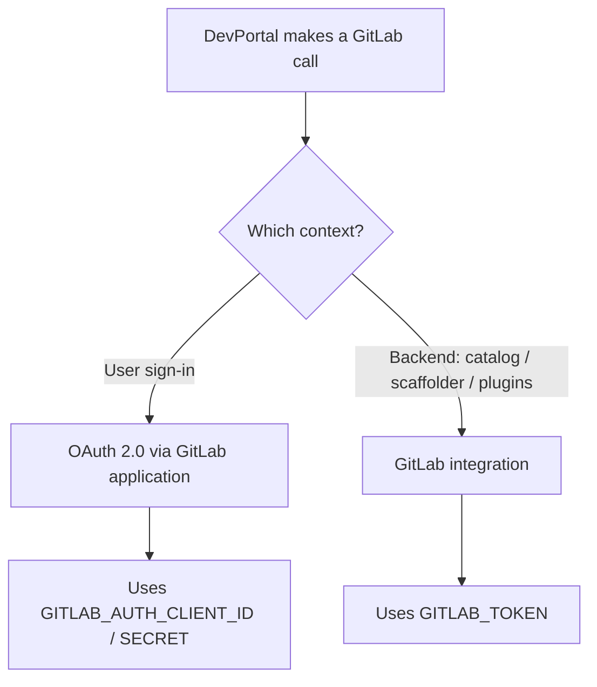

GitLab is a supported identity and SCM provider in VeeCode DevPortal. When you use the `gitlab` profile, DevPortal configures GitLab OAuth authentication, the GitLab integration token for backend operations, and GitLab group-based org sync.

## Overview

VeeCode DevPortal interacts with GitLab in two distinct ways:

- **[Authentication](./gitlab-auth.md)**: Users sign in with their GitLab accounts via OAuth 2.0.
- **Backend integrations**: The DevPortal backend (catalog, scaffolder, plugins) accesses GitLab APIs using a Personal or Group Access Token.

Org sync ingests GitLab groups and their members as Backstage `Group` and `User` catalog entities.

## Profile

Set `VEECODE_PROFILE=gitlab` to activate the pre-bundled `app-config.gitlab.yaml` configuration.

## Required environment variables

| Variable | Description |
|---|---|
| `GITLAB_HOST` | GitLab hostname (e.g., `gitlab.com` or `gitlab.example.com`) |
| `GITLAB_AUTH_CLIENT_ID` | OAuth Application ID (for sign-in) |
| `GITLAB_AUTH_CLIENT_SECRET` | OAuth Application Secret |
| `GITLAB_TOKEN` | Personal or Group Access Token (`read_api` scope, for integrations) |
| `GITLAB_GROUP` | Root group for org sync and repo discovery (e.g., `my-org`) |

## Optional environment variables

| Variable | Default | Description |
|---|---|---|
| `GITLAB_GROUP_PATTERN` | `[\s\S]*` | Pattern to match sub-groups for catalog sync |

## Decision tree



## Quick start

### Minimal `docker run`

```bash
docker run -p 7007:7007 \
  -e VEECODE_PROFILE=gitlab \
  -e GITLAB_HOST=gitlab.com \
  -e GITLAB_AUTH_CLIENT_ID=<your-client-id> \
  -e GITLAB_AUTH_CLIENT_SECRET=<your-client-secret> \
  -e GITLAB_TOKEN=<your-access-token> \
  -e GITLAB_GROUP=<your-root-group> \
  veecode/devportal:latest
```

### Docker Compose

```yaml
services:
  devportal:
    image: veecode/devportal:latest
    ports:
      - "7007:7007"
    environment:
      VEECODE_PROFILE: gitlab
      GITLAB_HOST: gitlab.com
      GITLAB_AUTH_CLIENT_ID: ${GITLAB_AUTH_CLIENT_ID}
      GITLAB_AUTH_CLIENT_SECRET: ${GITLAB_AUTH_CLIENT_SECRET}
      GITLAB_TOKEN: ${GITLAB_TOKEN}
      GITLAB_GROUP: ${GITLAB_GROUP}
      GITLAB_GROUP_PATTERN: "[\\.\\s\\S]*"
```

## References

- [GitLab Auth & Configuration](./gitlab-auth.md)
- [Backstage GitLab Auth Provider](https://backstage.io/docs/auth/gitlab/provider/)
- [Backstage GitLab Integration](https://backstage.io/docs/integrations/gitlab/locations/)
