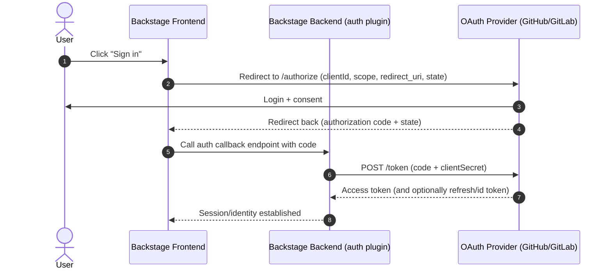

An usually confusing topic in Backstage world are its backend integrations and authentication mechanisms. This section explain a bit of this and prepares you to understand common senarios and to read deeper documentation.

## Why should I read this?

Even if you are using **VeeCode Profiles** to simplify your setup you still need to create tokens and credentials for authentication and integrations. DevPortal cannot do this for you and there are a few decisions you must take. This document will help you understand the options and make the right choices.

## Authentication overview

Backstage authentication typically follows a standard OAuth 2.0 / OpenID Connect pattern, where the user is redirected to an external Identity Provider (IdP) or SaaS platform to sign in, and then redirected back to Backstage.

:::tip
This is the recommended approach for most scenarios, as it leverages the security and features of established identity providers, and avoids handling sensitive credentials directly within Backstage.
:::

At a high level, the flow looks like this:

- The Backstage frontend starts the sign-in and redirects the user to the chosen provider (for example GitHub or GitLab).
- After the user authorizes access, the provider redirects back to Backstage with an authorization code.
- The Backstage backend auth plugin exchanges that code for tokens and establishes the Backstage identity/session.

To enable this, you must register an OAuth application on the target platform (e.g., create an OAuth App (or GitHub App) on GitHub, or an Application on GitLab) and generate credentials such as a `clientId` and `clientSecret`. These values are then configured in Backstage (usually in your `app-config.yaml`) for the corresponding auth provider, along with the correct callback/redirect URL expected by your Backstage instance.

:::note
The LDAP auth flow is different, as it typically involves direct communication between the Backstage backend and the LDAP server, without redirects. It is actually kinda simpler and yet uglier and unsafe, but some customers ask for it anyway.
:::

## Integrations overview

In Backstage, an **integration** is the configuration that lets the backend (and sometimes specific plugins) talk to external systems like source control providers (GitHub/GitLab/Bitbucket), artifact registries, CI/CD systems, cloud APIs, etc.

Most integrations are configured in `app-config.yaml` (or environment variables) and then reused by multiple plugins. For example, the catalog and scaffolder can use SCM integrations to read `catalog-info.yaml`, fetch templates, open pull requests, or query repository metadata.

Credential-wise, integrations usually fall into one of these simple patterns:

- **OAuth application credentials** (for example `clientId` / `clientSecret`), commonly used when a plugin needs OAuth flows or token exchange.
- **Personal Access Tokens (PATs) or similar static tokens**, commonly used for server-to-server API calls.
- **Both**, where Backstage prefers OAuth/user tokens when available but can fall back to a configured token for background jobs or automation.

## Organizational data

A special case of integrations are **organizational data sources**, which are used to populate the Backstage catalog with **Users** and **Groups** from external systems (for example: GitHub Organizations/teams, GitLab groups, LDAP/Active Directory, Azure AD, etc.).

This matters because many Backstage features assume your organization exists as catalog entities:

- **Ownership and metadata**: entities often declare owners like `spec.owner: group:default/platform-team`.
- **Search and discovery**: users and teams can be browsed like any other catalog entity.
- **Permissions/RBAC**: the permission system can make authorization decisions based on “who is this user?” and “which groups are they in?”.

In practice, the flow is usually:

- An org data provider syncs users/groups into the catalog.
- When a user signs in, Backstage maps the authenticated identity to a catalog **User** entity.
- Permission policies and permission-enabled plugins can then check group membership (from the catalog) to allow/deny actions (for example: “only members of `group:default/platform-team` can register new components”).
- Permissions can also be based on `roles` assigned to users/groups in the catalog.

## Understand the differences

Integrations configuration are different than authentication configuration, even if they sometimes share similar concepts (like OAuth apps or tokens).

- **Authentication** answers “who is the user?” and is mostly about the frontend sign-in flow and establishing a Backstage session.
- **Integrations** answer “how can Backstage call external APIs?” and are typically used by both **core** and **third-party** plugins to fetch data, read repositories, validate URLs, enrich entities, or trigger actions.

:::important
Integrations are most likely to be reused by both core Backstage and multiple plugins, while authentication is exclusively used by its identity provider.
:::

## Understand service identity

Integrations are configured in the backend and used server-side, **usually assuming a service identity** (for example: a PAT or OAuth app credentials). This means that **for most Backstage integrations** the integration represents DevPortal (Backstage) itself when it talks to external systems, not the end user.

There are exceptions to this rule, but they are less common and are always plugin-specific (for example: some plugins may support user token exchange to act on behalf of the signed-in user). A plugin that supports acting on behalf of the user will usually document how to set it up and mention such behavior.

For example, the **Kubernetes plugin** can (depending on configuration) propagate the signed-in user identity when talking to the Kubernetes API, instead of always using only a single backend service credential.

## Understand reuse implications

You should understand the generic implications of reusing the same OAuth credentials for authentication and integrations. **This is supported** and pretty much ok in local development and PoCs, but not recommended for production.

The main concern is that the shared client must be granted the combined set of scopes required for authentication and integrations. As a result, users are asked to consent to broader permissions than strictly necessary for sign-in, and the blast radius of those credentials is larger than it needs to be. Also consent screens and scopes will scare users and make them question the security of your Backstage instance.
